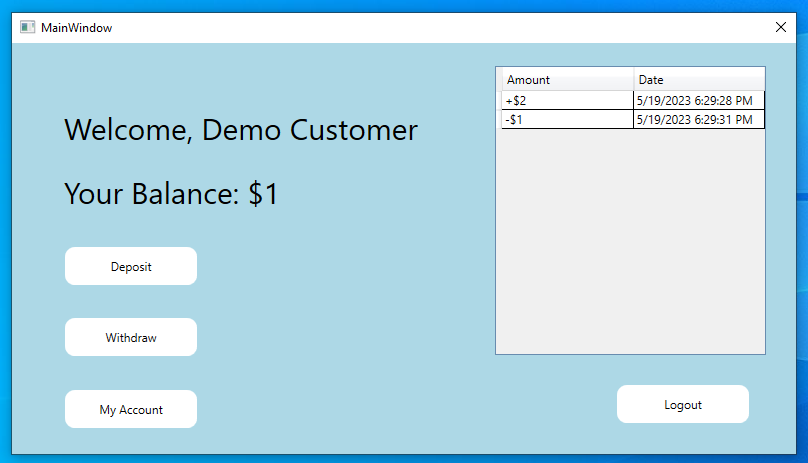

# BankingSys
A mock banking system C# WPF app (college project)

**Demo Login:**\
**User: user and user**\
**Admin: admin and admin**

It uses no external packages/libraries.

The application has many different screens to access, first the login screen which verifies username/password and directs them to the appropriate screen (user or admin)

The actual screens are just pages that are being switched between one frame.

Next, there is the user panel, which contains a log of all their transactions, as well as options to deposit/withdraw money (separate screens), their name and balance is also displayed.

Along with this, there is also the "My Account" section for both Customers and Admins which lets them reset their own password, or delete their own account

And finally there is the logout button, which logs you out and puts you back to the login screen.

Onto the admin section, there is an area to manage a user by typing in their name, along with a list of all users and their balance, the bank's total money from all accounts, and an option to create another admin account, as well as access the "My Account" section.

In the manage user section, there is a list of all of their transactions (amount/date/time) and an area to deposit/withdraw money from their account, as well as their current balance and name/username.

There is also a section to change their password, as well as options to suspend/unsuspend them (prevent logging in), and an option to delete their account entirely.

It's important to note that all of the input fields are checked, not only for exceptions with try/catch, but also for invalid/mistake input such as leaving the default value (such as "New Password"), or putting nothing/spaces in the box, they must have printable characters.

Along with this, the amounts being deposited/withdrawn are also checked to ensure they aren't zero or negative. Duplicate usernames are also checked globally for both users and employees, to ensure there are no issues there.

As far as the code goes, UserDB.cs (static) contains many methods for managing a user, such as registering, deleting, changing passwords, checking usernames/input, logging in, logging out, the lists of customers/employees and the user/employee being currently used are stored here (public).

A transaction is its own class with a string for the amount, and DateTime.now for the current date, all transactions are stored in a list for each customer, which are later printed out onto a log (DataGrid) in both the user and admin management panel.

The buttons are simply linked from the xaml to methods in the xaml.cs, and the text/number fields will erase the default value once clicked the first time

As far as inheritance goes, there are three classes, Person (the base), Employee (inherits from person, adds nothing), and Customer (inherits from person, adds balance and transactions).

Most functions of the application use the same pages/methods for both user and admin, but not all.

There are also code comments on many of the methods.
